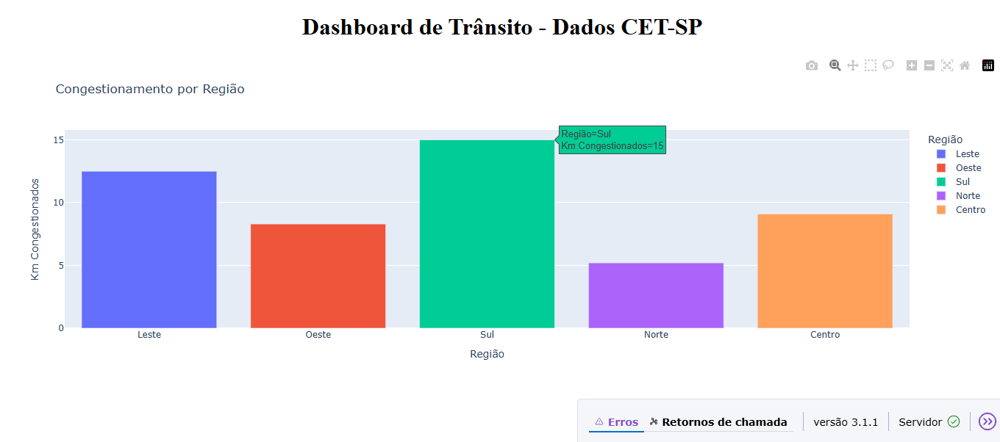

# 📊 Dashboard de Trânsito com Dados Abertos da CET-SP

Este projeto tem como objetivo construir um **dashboard interativo** utilizando dados abertos da **CET-SP (Companhia de Engenharia de Tráfego de São Paulo)**. O foco principal é a visualização dos níveis de congestionamento por região da cidade, fornecendo insights acessíveis e rápidos sobre a situação do tráfego.

## 🚀 Tecnologias e Ferramentas Utilizadas

- **Python 3.11**
- **Pandas** – para manipulação e análise de dados
- **Plotly** – para criação de gráficos interativos
- **Dash** – para construção da aplicação web interativa
- **Dados Abertos da CET-SP** – fonte oficial de dados públicos
- **Visual Studio Code** – ambiente de desenvolvimento

## 📈 Funcionalidades

- Gráfico de barras interativo com os níveis de congestionamento por região (Leste, Oeste, Sul, Norte, Centro)
- Interface web simples e responsiva utilizando Dash
- Atualização dinâmica dos dados carregados em CSV



## 🛠 Tecnologias Utilizadas

- [Python](https://www.python.org/)
- [Dash](https://dash.plotly.com/)
- [Plotly](https://plotly.com/python/)
- [Pandas](https://pandas.pydata.org/)

## ▶️ Como Executar

1. Clone este repositório:

```bash
git clone https://github.com/Eduuh007/dashboard-transito-cetsp.git
cd dashboard-transito-cetsp

2. Instale as dependências
Certifique-se de ter o Python instalado (versão 3.10 ou superior).

pip install -r requirements.txt

3. Execute o projeto

python app.py

4. Acesse no navegador
Abra o seguinte endereço no seu navegador:

http://127.0.0.1:8050/

## 🙋‍♂️ Desenvolvido por

**Eduardo de Sousa Martins**

- 🔗 [GitHub: Eduuh007](https://github.com/Eduuh007)
- 🔗 [LinkedIn: Eduardo Martins](https://www.linkedin.com/in/eduardo-martins-575521245)